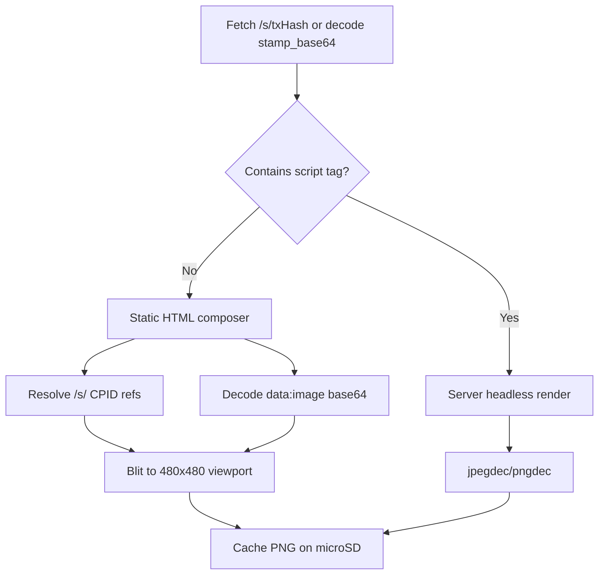

# MicroPython Port Research: StampFolio → Pimoroni Presto

Research document for porting StampFolio stamp display capabilities to the **Pimoroni Presto** (sometimes referred to as “Hey Presto” in Pimoroni’s demo code). This is **not** a full iOS app port — it evaluates feasibility for a **desk companion / digital stamp frame** that shows Bitcoin Stamps from configured wallet addresses.

**Date:** 2026-08-25  
**Related:** [Stampchain API](./app-build/STAMPCHAIN-API.md) · [Domain Models](./app-build/DOMAIN-MODELS.md) · [Caching Strategy](./app-build/CACHING.md)

---

## Executive Summary

| Question | Answer |
|----------|--------|
| Is MicroPython suited? | **Yes** — Presto ships with MicroPython firmware, `presto`, PicoGraphics, PicoVector, and Wi-Fi helpers. |
| Can the processor handle the app? | **A focused stamp viewer, yes.** A faithful port of the full StampFolio iOS app, **no**. |
| Can we support all stamp file types (SVG, HTML, etc.)? | **Not natively on-device.** Tiered support with server-side rasterization is the realistic path to broad coverage. |

**Recommended product scope:** **StampFrame for Presto** — fetch stamps for one or more wallets from Stampchain, cache on microSD, display fullscreen with touch navigation and optional slideshow. Omit Ordinals, Counterparty, QR scanning, WebKit rendering, and rich media playback.

---

## Pimoroni Presto — Hardware Specifications

| Category | Specification |
|----------|---------------|
| **Product** | Pimoroni Presto (PIM725 standalone / PIM765 starter kit) |
| **Dimensions** | ~110 × 92 × 80 mm (H × W × D, with stand) |
| **Microcontroller** | Raspberry Pi **RP2350B** (QFN-80, 48 usable GPIO) |
| **CPU** | Dual **Arm Cortex-M33** @ up to **150 MHz** (optional RISC-V Hazard3 cores — firmware-dependent) |
| **On-chip SRAM** | **520 KB** |
| **External PSRAM** | **8 MB** |
| **Flash** | **16 MB** QSPI flash (execute-in-place supported) |
| **Expandable storage** | **microSD** card slot |
| **Display** | **4″ square IPS LCD**, **480 × 480** pixels, capacitive touch overlay |
| **Wireless** | Raspberry Pi **RM2** module (Infineon **CYW43439**) — **Wi-Fi 4** (802.11 b/g/n), **Bluetooth 5.4** |
| **Ambient lighting** | **7× SK6812** (NeoPixel-compatible) RGB LEDs |
| **Audio** | **Piezo speaker** (alert tones / beeps — not hi-fi playback) |
| **USB** | **USB-C** (power + programming) |
| **Expansion** | **Qw/ST** (Qwiic / STEMMA QT) connector |
| **Debug** | 3-pin JST-SH (units manufactured after June 2025) |
| **Power** | USB-C, or **2-pin JST-PH** battery (**3.0–5.5 V**, no onboard LiPo charger) |
| **User controls** | Reset button, Boot button (usable as user button) |
| **Programming** | **MicroPython** (pre-installed) or **C/C++** (Pimoroni SDK boilerplate) |
| **Included software** | MicroPython firmware, app launcher, example apps (clock, photo frame, Wi-Fi demos) |

### Presto Software Stack (MicroPython)

| Module | Purpose |
|--------|---------|
| `presto` | Hardware abstraction — display, touch, Wi-Fi, ambient LEDs |
| `picographics` | Bitmap drawing, fonts, framebuffer |
| `picovector` | Vector paths, anti-aliased shapes, Alright Fonts (`.af`) — **not an SVG parser** |
| `jpegdec` | JPEG decode (BitBank JPEGDEC) |
| `pngdec` | PNG decode (BitBank PNGdec) — crop, scale, rotate |
| Wi-Fi helpers | Network connectivity via RM2 (e.g. EzWiFi in Pimoroni docs) |

### Display Modes

The `Presto()` constructor supports options that affect performance:

- `full_res=True` — native **480×480** (crisp, slower)
- `full_res=False` — lower internal resolution, upscaled (faster)
- `layers=1/2` — optional double-buffering via PicoGraphics layers
- `direct_to_fb=True` — draw directly to front buffer in full-res mode
- `ambient_light=True` — auto-sync rear RGB LEDs to screen content

Pimoroni’s photo-frame example recommends **pre-processing images** to **240×240** or **480×480**, **non-progressive JPEG**, because on-device resize of large images is slow.

---

## StampFolio iOS App — Relevant Context

StampFolio is a SwiftUI iOS app that displays Bitcoin Stamps from the [Stampchain API](https://stampchain.io/api/v2). For porting research, the critical subset is **stamp content rendering** and **wallet balance fetching**.

### Stamp content routing (iOS)

The iOS app routes stamps by `stamp_mimetype` (`fileType` in `StampData`):

| MIME type | iOS renderer | Endpoint |
|-----------|--------------|----------|
| `image/png`, `image/jpeg`, … | Kingfisher (`StampPixelView`) | `https://stampchain.io/s/{txHash}` |
| `image/gif` | KFAnimatedImage | `/s/{txHash}` |
| `image/webp`, `image/avif` | Kingfisher | `/s/{txHash}` |
| `image/svg+xml` | WKWebView (`StampVectorView`) | `/s/{txHash}` |
| `text/html` | WKWebView (`StampVectorView`) | `https://stampchain.io/content/{txHash}` |
| `text/plain` | Fetched text view | `/s/{txHash}` |
| `audio/*`, `video/*` | AVKit / placeholder | `/s/{txHash}` |
| `application/javascript`, `text/css`, `application/gzip` | Library badge (non-visual) | N/A |

See: `StampFolio/Core/Domain/Models/StampData.swift`, `StampFolio/Features/Collection/Views/StampCardView.swift`.

### Bitcoin Stamp payload constraints

| Format | Max payload | Notes |
|--------|-------------|-------|
| Classic (Base64 / OP_MULTISIG) | ~**7 KB** | Original pixel-art stamps (often 24×24) |
| OLGA (P2WSH binary) | ~**64 KB** (65,535 byte length prefix) | Larger artwork, 50% smaller tx size |

These limits mean stamp **downloads are tiny** compared to Presto’s **8 MB PSRAM** — memory is not the bottleneck; **decoding and rendering capability** is.

### iOS features outside Presto scope

The full app also includes:

- Multi-tab UI (Stamps, Ordinals, Counterparty, Search)
- SwiftData wallet persistence
- QR code wallet scanning (AVFoundation)
- Kingfisher image caching with downsampling
- Full-screen zoom/pan (`StampDetailView`)
- GIF animation toggle, market data, filters, settings

None of these map 1:1 to a 480×480 microcontroller display.

---

## Feasibility Assessment

### Is MicroPython suited?

**Yes.** Presto is designed for MicroPython:

- Firmware and launcher ship pre-installed
- Official Learn guide and examples (photo frame, clock, Wi-Fi)
- Built-in JPEG/PNG decoders integrated with the display stack
- Wi-Fi module supported in Pimoroni’s MicroPython builds

C/C++ via the Pimoroni SDK is an option for performance-critical paths later, but MicroPython is the correct starting point.

### Can the RP2350 handle “the app”?

**Partially — scoped to a stamp viewer.**

| Capability | Feasible? | Notes |
|------------|-----------|-------|
| HTTP GET to Stampchain API | ✅ | Wi-Fi + `urequests` / `aiohttp`-style patterns |
| JSON parsing (`ujson`) | ✅ | Balance responses are small |
| Download stamp bytes (≤64 KB) | ✅ | Fits easily in PSRAM |
| Decode PNG / JPEG | ✅ | Native `pngdec` / `jpegdec` |
| Display 480×480 with touch | ✅ | Core Presto use case |
| Cache stamps on microSD | ✅ | Mirror iOS `StampContentCache` concept |
| Slideshow / swipe navigation | ✅ | Photo-frame example is a template |
| Nearest-neighbor upscale (24×24 pixel art) | ✅ | Ideal for classic stamps |
| Animated GIF | ⚠️ | No built-in decoder; static frame or custom library |
| WebP / AVIF / BMP | ❌ on-device | Needs conversion |
| SVG rendering | ❌ on-device | PicoVector ≠ SVG; needs raster proxy |
| HTML rendering | ⚠️ tiered | Static HTML (no JS) on-device; interactive HTML needs proxy |
| Audio / video playback | ❌ | Piezo only; no video decoder |
| QR wallet scanning | ❌ | No camera |
| Ordinals / Counterparty tabs | ❌ | Different protocols, heavy/browser content |
| Full SwiftUI grid with hundreds of thumbnails | ❌ | Single 480×480 screen — design for one stamp at a time |

**Performance notes from the community:** Presto can decode pre-sized JPEGs/PNGs well, but ** resizing large images on-device is slow**. A WiiM forum project noted needing an **external web service** to resize album art before display. The same pattern applies to non-native stamp formats.

---

## Stamp File Type Support Matrix

| Format | iOS | Presto native | Recommended approach |
|--------|-----|---------------|----------------------|
| **PNG** | ✅ Kingfisher | ✅ `pngdec` | Decode locally; scale to fit 480×480 |
| **JPEG** | ✅ Kingfisher | ✅ `jpegdec` | Decode locally; non-progressive preferred |
| **GIF** | ✅ animated | ⚠️ partial | Static first frame (v1); optional GIF library (v2) |
| **WebP** | ✅ | ❌ | Server/proxy → PNG or JPEG |
| **AVIF** | ✅ | ❌ | Server/proxy → PNG or JPEG |
| **BMP** | ✅ | ❌ | Server/proxy → PNG |
| **SVG** | ✅ WKWebView | ❌ | Server rasterize (resvg, cairosvg, etc.) |
| **HTML** | ✅ WKWebView | ⚠️ tiered | Static layout composer on-device; JS-heavy → server PNG |
| **text/plain** | ✅ | ✅ | Fetch + wrap text with PicoGraphics / PicoVector |
| **audio/** | ✅ AVKit | ❌ | Icon + stamp metadata only |
| **video/** | ✅ AVKit | ❌ | Icon + stamp metadata only |
| **JS / CSS / GZIP** | badge only | ❌ | Skip (not visual stamps) |
| **SRC-721** (recursive) | varies | ⚠️ | Depends on composed assets; often PNG/JPEG children |

### Can we support SVG and HTML?

**SVG:** still needs server rasterization or a dedicated SVG subset parser — PicoVector is not an SVG loader.

**HTML:** your intuition is partly right. HTML stamps **are** stored on-chain as Base64 (classic) or binary (OLGA), but **Stampchain already decodes them** when you fetch over HTTP. The real question is not decoding — it is **rendering HTML/CSS/JS without a browser**.

---

## HTML Stamps — Base64, “Iframe”, and Workarounds

### How HTML stamps are actually stored and served

| Layer | Format | What you get |
|-------|--------|--------------|
| **On-chain / indexer DB** | Base64 string in `stamp_base64` (API field on `/stamps/{id}`) | Raw encoded payload |
| **HTTP `/s/{txHash}`** | Decoded UTF-8 HTML | Ready-to-parse markup (`Content-Type: text/html`) |
| **HTTP `/content/{txHash}`** | Same decoded HTML (iOS uses this for HTML stamps) | Used by StampFolio’s `StampVectorView` / `WKWebView` |

**You do not need to Base64-decode on Presto if you fetch from Stampchain** — the server has already done it. Base64 decode on-device is only needed if you read `stamp_base64` directly from the JSON API:

```python
import ubinascii
html = ubinascii.a2b_base64(stamp["stamp_base64"]).decode("utf-8")
```

Both classic (~7 KB) and OLGA (~64 KB) HTML payloads fit easily in Presto’s 8 MB PSRAM after decode.

### There is no iframe on Presto — but you can build the equivalent

iOS uses `WKWebView` as an isolated rendering surface (conceptually like an iframe). **Presto has no WebView, HTML engine, or JavaScript runtime** in MicroPython or C++.

What “iframe-like container” means in practice on Presto:

```
┌─────────────────────────────────────┐
│  Presto 480×480 framebuffer         │
│  ┌───────────────────────────────┐  │
│  │  "Viewport" — your render     │  │  ← You implement this in PicoGraphics
│  │  target for one stamp         │  │
│  └───────────────────────────────┘  │
│  Stamp # overlay, touch nav         │
└─────────────────────────────────────┘
```

You allocate a logical viewport and draw into it — but **you** must interpret the HTML, not load it into a browser.

### HTML stamps are not all “basic” — two tiers exist

Real examples from Stampchain (Aug 2026):

| Stamp | Size | Scripts | Feasible on Presto? |
|-------|------|---------|-------------------|
| #1462443 “Story of OLGA” | 1.2 KB | **0** — static HTML + CSS + `` + text | **Yes** — on-device layout renderer |
| #1465071 “STAMP·PAINT” | 28 KB | **1** — canvas drawing app | **Partial** — static screenshot or server render |
| #1472320 “STAMPCAST” | 41 KB | **1 huge inline script** — WebRTC, WebSocket, Nostr, crypto | **No on-device** — server rasterize only |

Many HTML stamps under 65 KB are **static compositions** (positioned divs, embedded images, styled text). Others are **full web apps** that require a browser and network services.

### Workaround 1 — On-device static HTML renderer (best for simple stamps)

For HTML with **no JavaScript** (or JS you intentionally ignore), implement a **minimal layout engine**:

1. Fetch decoded HTML from `https://stampchain.io/s/{txHash}`.
2. Parse a **supported subset**:
   - ``
   - `<div class="s t" style="…font-size:…cqh;color:#…">text</div>`
   - Inline `background:#000` on `html,body`
3. For each `/s/CPID` reference → fetch child stamp → decode PNG/JPEG with `pngdec`/`jpegdec`.
4. Map percentage positions to 480×480 pixel coordinates.
5. Draw text with PicoGraphics or PicoVector (map `cqh` units approximately).
6. Cache the **composited result** as PNG on microSD.

This matches stamps like the OLGA story page, which is pure layout:

```html
<div id="c">
  
  <div class="s t" style="left:3%;top:1.38%;...">The Story of OLGA</div>
  ...
</div>
```

No JS execution required — only recursive `/s/` fetches (same pattern Stampchain uses when serving HTML).

**Also handle without a browser:**

- `data:image/png;base64,...` in `` → decode Base64 locally, blit to framebuffer
- Plain text nodes → wrap and draw
- Basic colors from inline styles (`#RRGGBB`)

### Workaround 2 — Extract-and-blit (fast path)

Before building a full layout parser, scan decoded HTML for:

1. **`data:image/*;base64,`** — decode and display directly (common in small stamps).
2. **Single ``** — fetch one child image, scale to 480×480.
3. **No visual elements found** — show placeholder with stamp number.

This covers a surprising number of simple HTML stamps with minimal code.

### Workaround 3 — Server-side render (JS-heavy stamps)

For stamps with `<script>` blocks (WebRTC, canvas animation, Nostr, etc.):

1. Presto detects `<script` in the HTML string (cheap scan).
2. Requests a **480×480 PNG snapshot** from a render proxy:
   - Headless Chromium / Playwright loads `https://stampchain.io/content/{txHash}`
   - Waits for render (or fixed timeout)
   - Returns PNG
3. Presto decodes PNG locally and caches on microSD.

This is the only viable path for interactive HTML like STAMPCAST. The stamp is ≤65 KB, but its **runtime requirements** (WebSocket, WebRTC, `window`, DOM) far exceed what an MCU can provide — size is not the limiting factor.

### Workaround 4 — Hybrid router (recommended)

```python
def render_html_stamp(tx_hash, html_bytes):
    html = html_bytes.decode("utf-8")

    if "<script" not in html.lower():
        return compose_static_html(html, viewport=480)  # Workaround 1/2

    png = fetch_render_proxy(tx_hash, size=480)         # Workaround 3
    if png:
        return decode_png(png)

    return draw_placeholder(stamp_id)                   # Fallback
```



### MicroPython vs C++ for HTML workarounds

| Approach | MicroPython | C++ |
|----------|-------------|-----|
| Base64 decode | `ubinascii.a2b_base64` | TinyBase64 / mbedtls |
| Static HTML subset parser | Practical in pure Python | Faster, same logic |
| Recursive `/s/` fetch + PNG blit | Good fit | Good fit |
| Embedded JS engine (JerryScript, etc.) | Theoretically possible, **impractical** for real stamp HTML | Same — stamps use browser APIs |
| Real iframe/WebView | **Not available** | **Not available** on RP2350 |

**Recommendation:** implement Workaround 4 in MicroPython. Promote the static HTML composer to C++ only if profiling shows parse/compose time is too slow for slideshow use.

### Summary: what you CAN do for HTML stamps

| Technique | Covers | On-device? |
|-----------|--------|------------|
| Fetch decoded HTML from Stampchain | All HTML stamps | Yes |
| Base64 decode from `stamp_base64` | All HTML stamps | Yes |
| Static layout composer (no JS) | Layout + img + text stamps | Yes |
| `data:image` Base64 extract | Many small stamps | Yes |
| Recursive `/s/` child fetch | SRC-style compositions | Yes |
| Full CSS/JS/DOM rendering | Interactive web apps | **No** |
| Iframe / WebView container | All HTML (like iOS) | **No** — build viewport manually |
| Server PNG snapshot | JS-heavy stamps | Yes (with proxy) |

---

## Recommended Architecture: StampFrame for Presto

```
┌─────────────────────────────────────────────────────────────┐
│                     Pimoroni Presto                          │
│  ┌──────────┐   ┌─────────────┐   ┌──────────────────────┐  │
│  │  Touch   │   │  main.py    │   │  microSD cache       │  │
│  │  480×480 │◄──│  slideshow  │◄──│  /stamps/{txHash}.png│  │
│  └──────────┘   │  UI loop    │   │  /meta/{txHash}.json │  │
│                 └──────┬──────┘   └──────────────────────┘  │
│                        │                                     │
│         ┌──────────────┼──────────────┐                      │
│         ▼              ▼              ▼                      │
│    jpegdec/pngdec  PicoGraphics   Wi-Fi (RM2)               │
└────────────────────────┬────────────────────────────────────┘
                         │ HTTPS
                         ▼
              ┌──────────────────────┐
              │  stampchain.io       │
              │  /api/v2/stamps/     │
              │    balance/{address} │
              │  /s/{txHash}         │
              └──────────┬───────────┘
                         │ (SVG/HTML/WebP/AVIF only)
                         ▼
              ┌──────────────────────┐
              │  Optional raster     │
              │  proxy service       │
              │  GET /preview/{hash} │
              │  → 480×480 PNG       │
              └──────────────────────┘
```

### Core data flow

1. **Configure** wallet address(es) in `config.json` on the device (or via a one-time setup script over USB).
2. **Sync** — `GET https://stampchain.io/api/v2/stamps/balance/{address}`.
3. **Classify** each stamp by `stamp_mimetype` (same logic as `StampData.isImage`, `isSVG`, `isHTML`, etc.).
4. **Acquire content:**
   - PNG/JPEG → download from `/s/{txHash}`, decode locally.
   - text/plain → download, render wrapped text.
   - GIF → decode first frame (v1) or animate (v2+).
   - SVG/HTML/WebP/AVIF → fetch rasterized PNG from proxy; cache result.
5. **Display** fullscreen with stamp number overlay; swipe or tap edges for prev/next; optional timed slideshow.
6. **Cache** decoded PNGs and metadata on microSD to minimize API calls (see iOS [CACHING.md](./app-build/CACHING.md) for analogous strategy).

---

## Implementation Steps

### Phase 0 — Environment setup

1. Obtain Pimoroni Presto and a microSD card (included in starter kit).
2. Connect via USB-C; confirm the pre-installed MicroPython launcher runs.
3. Flash latest **“with-filesystem”** firmware from [pimoroni/presto releases](https://github.com/pimoroni/presto/releases) if needed.
4. Install [Thonny](https://thonny.org/) or use `mpremote` for file transfer.
5. Verify Wi-Fi connectivity using Pimoroni’s Wi-Fi examples.

### Phase 1 — Proof of concept (single stamp)

1. Hard-code one known PNG stamp `tx_hash`.
2. `urequests.get("https://stampchain.io/s/{txHash}")` → write bytes to `/sd/test.png` or RAM buffer.
3. Decode with `pngdec.PNG(display)` and `presto.update()`.
4. Confirm 480×480 display and acceptable decode time.

**Exit criteria:** One classic PNG stamp renders correctly from Stampchain.

### Phase 2 — Wallet sync and stamp list

1. Add `config.json` with one Bitcoin address.
2. Fetch balance JSON from Stampchain API.
3. Parse stamp list (`stamp`, `stamp_mimetype`, `tx_hash`, `stamp_url`).
4. Build an in-memory list sorted by stamp number.
5. Implement prev/next navigation via touch zones (photo-frame pattern).

**Exit criteria:** Swipe through all PNG/JPEG stamps in a wallet.

### Phase 3 — Format routing and caching

1. Port MIME classification from `StampData` (Python dict / functions).
2. Route PNG/JPEG to local decoder; text to text renderer.
3. Write cache layer on microSD:
   - Raw bytes: `/sd/cache/raw/{txHash}`
   - Rendered PNG: `/sd/cache/img/{txHash}.png`
   - Metadata sidecar: `/sd/cache/meta/{txHash}.json`
4. On sync, skip re-download if `file_hash` unchanged (when API provides it).

**Exit criteria:** Offline viewing of previously synced stamps; graceful handling of unsupported types.

### Phase 4 — HTML and non-native formats (SVG, WebP, AVIF)

1. **HTML router:** scan for `<script`; route static HTML to on-device composer, JS HTML to proxy.
2. **Static HTML composer:** parse positioned `` and text `<div>` elements; resolve child stamps recursively; map `%` layout to 480×480; handle `data:image/*;base64,` inline.
3. **Render proxy** for JS-heavy HTML and for SVG/WebP/AVIF (headless browser or image conversion service).
4. Show placeholder icon + stamp number when proxy unavailable.

**Exit criteria:** Static HTML stamps (e.g. layout + text + embedded images) render on-device; JS-heavy stamps render via proxy; unsupported stamps show clear fallback UI.

### Phase 5 — Polish

1. Slideshow timer (configurable interval — mirror iOS `slideshowInterval`).
2. Ambient LED sync (`Presto(ambient_light=True)`).
3. Stamp number / edition overlay (mirror `StampCardView` pills, simplified).
4. Error states: no Wi-Fi, empty wallet, decode failure, retry.
5. Optional: multi-wallet rotation.

**Exit criteria:** Stable desk-frame experience suitable for daily use.

### Phase 6 — Out of scope (future / different hardware)

- Ordinals and Counterparty protocol support
- QR wallet setup on-device
- Full GIF animation at 480×480
- Video/audio playback
- Market data and filtering UI
- SRC-20 / SRC-721 token management

---

## What Is Possible vs What Is Not

### Possible (recommended v1 scope)

- MicroPython app running natively on Presto
- Wi-Fi fetch from Stampchain API
- Wallet balance → stamp list for one or more addresses
- Fullscreen stamp display with touch navigation
- PNG and JPEG stamps (majority of classic pixel art)
- Plain text stamps
- microSD caching for offline viewing
- Slideshow mode
- Ambient RGB lighting tied to displayed stamp
- Nearest-neighbor upscale for small pixel-art stamps (24×24 → 480×480)
- Static preview for GIF stamps
- Static HTML stamps (layout + CSS + embedded `/s/` images, no JavaScript)
- HTML with inline `data:image/*;base64` payloads
- Graceful placeholders for unsupported types

### Possible with additional infrastructure

- SVG stamps (via server-side rasterization)
- HTML stamps with JavaScript / WebRTC / canvas apps (via headless browser render → PNG)
- WebP / AVIF stamps (via server conversion)
- Animated GIF (custom MicroPython GIF decoder or pre-converted frame sequence on SD)

### Not possible (on Presto as-is)

- Real iframe / WebView container (no HTML engine on RP2350 — build a manual viewport instead)
- Full CSS cascade, flexbox, grid, or `@media` layout engine
- JavaScript execution for interactive stamp apps (WebSocket, WebRTC, DOM APIs)
- Faithful 1:1 port of StampFolio iOS (SwiftUI, tabs, WebKit, AVKit)
- Native WebP / AVIF decode without adding large third-party libraries
- Video playback
- Rich audio playback (beyond piezo beeps)
- QR code scanning (no camera)
- Ordinals / Counterparty content requiring browser-grade rendering
- Displaying hundreds of stamp thumbnails simultaneously (wrong form factor — use one-at-a-time or tiny 2×2 grid at most)
- On-device resize of large progressive JPEGs at acceptable speed (pre-scale instead)

---

## MicroPython vs C++

| Aspect | MicroPython | C++ (Pimoroni SDK) |
|--------|-------------|---------------------|
| Time to first prototype | Fast | Slower |
| Wi-Fi / HTTP examples | Included | More boilerplate |
| JPEG/PNG decode | Built-in modules | Same underlying libraries |
| SVG/HTML | SVG needs proxy; static HTML composable on-device | Same — JS HTML needs proxy |
| GIF animation | Limited | Better performance potential |
| Maintenance | Easier for hobby deployment | Better for production firmware |

**Recommendation:** Prototype in MicroPython. Profile decode and slideshow timing; port only hot paths to C++ if needed.

---

## Key References

| Resource | URL |
|----------|-----|
| Pimoroni Presto product page | https://shop.pimoroni.com/products/presto |
| Presto GitHub (firmware + examples) | https://github.com/pimoroni/presto |
| Getting Started (Learn) | https://learn.pimoroni.com/article/getting-started-with-presto |
| Presto MicroPython API | https://github.com/pimoroni/presto/blob/main/docs/presto.md |
| PicoGraphics (JPEG/PNG) | https://github.com/pimoroni/pimoroni-pico/blob/main/micropython/modules/picographics/README.md |
| PicoVector | https://github.com/pimoroni/presto/blob/main/docs/picovector.md |
| Stampchain API | https://stampchain.io/docs#/ |
| StampFolio domain model | `./app-build/DOMAIN-MODELS.md` |
| Bitcoin Stamps FAQ (OLGA / file sizes) | https://stampchain.io/faq |

---

## Conclusion

**MicroPython on Pimoroni Presto is a good platform for a Bitcoin Stamp desk display**, not a full StampFolio port. The RP2350 has sufficient CPU, RAM, and storage for API calls, caching, and PNG/JPEG rendering at 480×480. Stamp payloads (≤64 KB) are well within device limits.

**All stamp file types cannot be rendered natively.** SVG and HTML require the same class of solution the iOS app solves with WebKit — but on Presto that must be **server-side rasterization** rather than an on-device browser. With a tiered pipeline (native decode first, proxy fallback second, placeholder last), most of the stamp catalog can be displayed meaningfully.

**Next step:** Implement Phase 1 proof of concept — fetch and display a single PNG stamp from Stampchain on Presto hardware.
