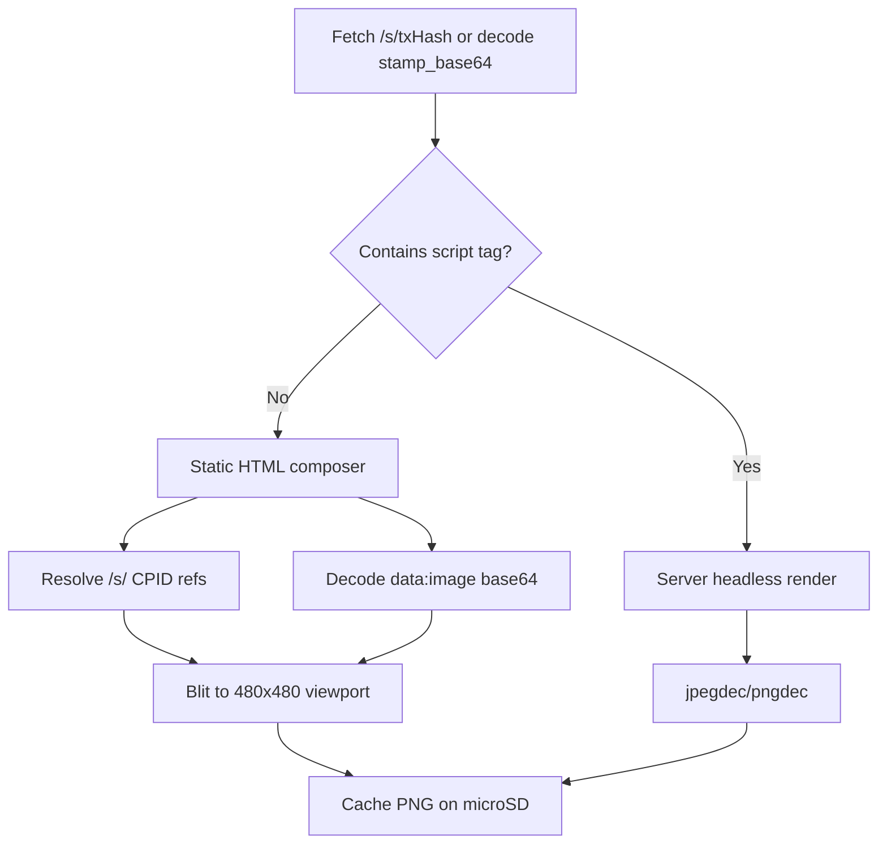
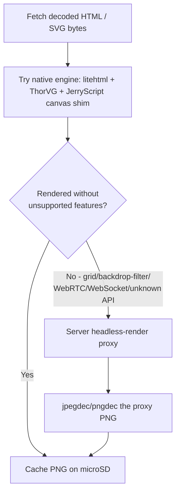

# MicroPython Port Research: StampFolio → Pimoroni Presto

Research document for porting StampFolio stamp display capabilities to the **Pimoroni Presto** (sometimes referred to as “Hey Presto” in Pimoroni’s demo code). This is **not** a full iOS app port — it evaluates feasibility for a **desk companion / digital stamp frame** that shows Bitcoin Stamps from configured wallet addresses.

**Date:** 2026-08-25  
**Related:** [Stampchain API](./app-build/STAMPCHAIN-API.md) · [Domain Models](./app-build/DOMAIN-MODELS.md) · [Caching Strategy](./app-build/CACHING.md)

---

## Executive Summary

| Question | Answer |
|----------|--------|
| Is MicroPython suited? | **Yes** — Presto ships with MicroPython firmware, `presto`, PicoGraphics, PicoVector, and Wi-Fi helpers. |
| Can the processor handle the app? | **A focused stamp viewer, yes.** A faithful port of the full StampFolio iOS app, **no**. |
| Can we support all stamp file types (SVG, HTML, etc.)? | **Mostly, yes — with real on-device engines, not just a server proxy.** Further research (see [Deep Dive](#deep-dive--real-on-device-htmlcssjssvg-rendering) below) found that a small HTML/CSS layout engine (litehtml), a vector/SVG engine (ThorVG), and a JS engine (JerryScript) **all have working prior art on RP2040/RP2350-class hardware**. They can be built into Presto as native MicroPython C++ modules — the same pattern already used for `picographics`/`jpegdec`/`pngdec`. A server-side render proxy is still recommended as a fallback for the hardest cases (WebRTC, heavy modern CSS), but it is no longer the *only* path for SVG and interactive HTML. |

**Recommended product scope:** **StampFrame for Presto** — fetch stamps for one or more wallets from Stampchain, cache on microSD, display fullscreen with touch navigation and optional slideshow. Treat native SVG/HTML/JS rendering as an advanced, incremental capability layered on top of the core viewer — not a blocker for v1. Omit Ordinals, Counterparty, QR scanning, and rich audio/video playback.

---

## Pimoroni Presto — Hardware Specifications

| Category | Specification |
|----------|---------------|
| **Product** | Pimoroni Presto (PIM725 standalone / PIM765 starter kit) |
| **Dimensions** | ~110 × 92 × 80 mm (H × W × D, with stand) |
| **Microcontroller** | Raspberry Pi **RP2350B** (QFN-80, 48 usable GPIO) |
| **CPU** | Dual **Arm Cortex-M33** @ up to **150 MHz** (optional RISC-V Hazard3 cores — firmware-dependent) |
| **On-chip SRAM** | **520 KB** |
| **External PSRAM** | **8 MB** |
| **Flash** | **16 MB** QSPI flash (execute-in-place supported) |
| **Expandable storage** | **microSD** card slot |
| **Display** | **4″ square IPS LCD**, **480 × 480** pixels, capacitive touch overlay |
| **Wireless** | Raspberry Pi **RM2** module (Infineon **CYW43439**) — **Wi-Fi 4** (802.11 b/g/n), **Bluetooth 5.4** |
| **Ambient lighting** | **7× SK6812** (NeoPixel-compatible) RGB LEDs |
| **Audio** | **Piezo speaker** (alert tones / beeps — not hi-fi playback) |
| **USB** | **USB-C** (power + programming) |
| **Expansion** | **Qw/ST** (Qwiic / STEMMA QT) connector |
| **Debug** | 3-pin JST-SH (units manufactured after June 2025) |
| **Power** | USB-C, or **2-pin JST-PH** battery (**3.0–5.5 V**, no onboard LiPo charger) |
| **User controls** | Reset button, Boot button (usable as user button) |
| **Programming** | **MicroPython** (pre-installed) or **C/C++** (Pimoroni SDK boilerplate) |
| **Included software** | MicroPython firmware, app launcher, example apps (clock, photo frame, Wi-Fi demos) |

### Presto Software Stack (MicroPython)

| Module | Purpose |
|--------|---------|
| `presto` | Hardware abstraction — display, touch, Wi-Fi, ambient LEDs |
| `picographics` | Bitmap drawing, fonts, framebuffer |
| `picovector` | Vector paths, anti-aliased shapes, Alright Fonts (`.af`) — **not an SVG parser** |
| `jpegdec` | JPEG decode (BitBank JPEGDEC) |
| `pngdec` | PNG decode (BitBank PNGdec) — crop, scale, rotate |
| Wi-Fi helpers | Network connectivity via RM2 (e.g. EzWiFi in Pimoroni docs) |

### Display Modes

The `Presto()` constructor supports options that affect performance:

- `full_res=True` — native **480×480** (crisp, slower)
- `full_res=False` — lower internal resolution, upscaled (faster)
- `layers=1/2` — optional double-buffering via PicoGraphics layers
- `direct_to_fb=True` — draw directly to front buffer in full-res mode
- `ambient_light=True` — auto-sync rear RGB LEDs to screen content

Pimoroni’s photo-frame example recommends **pre-processing images** to **240×240** or **480×480**, **non-progressive JPEG**, because on-device resize of large images is slow.

---

## StampFolio iOS App — Relevant Context

StampFolio is a SwiftUI iOS app that displays Bitcoin Stamps from the [Stampchain API](https://stampchain.io/api/v2). For porting research, the critical subset is **stamp content rendering** and **wallet balance fetching**.

### Stamp content routing (iOS)

The iOS app routes stamps by `stamp_mimetype` (`fileType` in `StampData`):

| MIME type | iOS renderer | Endpoint |
|-----------|--------------|----------|
| `image/png`, `image/jpeg`, … | Kingfisher (`StampPixelView`) | `https://stampchain.io/s/{txHash}` |
| `image/gif` | KFAnimatedImage | `/s/{txHash}` |
| `image/webp`, `image/avif` | Kingfisher | `/s/{txHash}` |
| `image/svg+xml` | WKWebView (`StampVectorView`) | `/s/{txHash}` |
| `text/html` | WKWebView (`StampVectorView`) | `https://stampchain.io/content/{txHash}` |
| `text/plain` | Fetched text view | `/s/{txHash}` |
| `audio/*`, `video/*` | AVKit / placeholder | `/s/{txHash}` |
| `application/javascript`, `text/css`, `application/gzip` | Library badge (non-visual) | N/A |

See: `StampFolio/Core/Domain/Models/StampData.swift`, `StampFolio/Features/Collection/Views/StampCardView.swift`.

### Bitcoin Stamp payload constraints

| Format | Max payload | Notes |
|--------|-------------|-------|
| Classic (Base64 / OP_MULTISIG) | ~**7 KB** | Original pixel-art stamps (often 24×24) |
| OLGA (P2WSH binary) | ~**64 KB** (65,535 byte length prefix) | Larger artwork, 50% smaller tx size |

These limits mean stamp **downloads are tiny** compared to Presto’s **8 MB PSRAM** — memory is not the bottleneck; **decoding and rendering capability** is.

### iOS features outside Presto scope

The full app also includes:

- Multi-tab UI (Stamps, Ordinals, Counterparty, Search)
- SwiftData wallet persistence
- QR code wallet scanning (AVFoundation)
- Kingfisher image caching with downsampling
- Full-screen zoom/pan (`StampDetailView`)
- GIF animation toggle, market data, filters, settings

None of these map 1:1 to a 480×480 microcontroller display.

---

## Feasibility Assessment

### Is MicroPython suited?

**Yes.** Presto is designed for MicroPython:

- Firmware and launcher ship pre-installed
- Official Learn guide and examples (photo frame, clock, Wi-Fi)
- Built-in JPEG/PNG decoders integrated with the display stack
- Wi-Fi module supported in Pimoroni’s MicroPython builds

C/C++ via the Pimoroni SDK is an option for performance-critical paths later, but MicroPython is the correct starting point.

### Can the RP2350 handle “the app”?

**Partially — scoped to a stamp viewer.**

| Capability | Feasible? | Notes |
|------------|-----------|-------|
| HTTP GET to Stampchain API | ✅ | Wi-Fi + `urequests` / `aiohttp`-style patterns |
| JSON parsing (`ujson`) | ✅ | Balance responses are small |
| Download stamp bytes (≤64 KB) | ✅ | Fits easily in PSRAM |
| Decode PNG / JPEG | ✅ | Native `pngdec` / `jpegdec` |
| Display 480×480 with touch | ✅ | Core Presto use case |
| Cache stamps on microSD | ✅ | Mirror iOS `StampContentCache` concept |
| Slideshow / swipe navigation | ✅ | Photo-frame example is a template |
| Nearest-neighbor upscale (24×24 pixel art) | ✅ | Ideal for classic stamps |
| Animated GIF | ⚠️ | No built-in decoder; static frame or custom library |
| WebP / AVIF / BMP | ❌ on-device | Needs conversion |
| SVG rendering | ⚠️ advanced | PicoVector ≠ SVG loader, but a native **ThorVG**/NanoSVG module can parse+rasterize most non-text SVGs on-device (see deep dive) |
| HTML rendering | ⚠️ tiered, upgradable | Static HTML (no JS) on-device today; a native **litehtml** (+ JerryScript for `<script>`) module raises this ceiling substantially, with proxy as fallback |
| Audio / video playback | ❌ | Piezo only; no video decoder |
| QR wallet scanning | ❌ | No camera |
| Ordinals / Counterparty tabs | ❌ | Different protocols, heavy/browser content |
| Full SwiftUI grid with hundreds of thumbnails | ❌ | Single 480×480 screen — design for one stamp at a time |

**Performance notes from the community:** Presto can decode pre-sized JPEGs/PNGs well, but ** resizing large images on-device is slow**. A WiiM forum project noted needing an **external web service** to resize album art before display. The same pattern applies to non-native stamp formats.

---

## Stamp File Type Support Matrix

| Format | iOS | Presto native | Recommended approach |
|--------|-----|---------------|----------------------|
| **PNG** | ✅ Kingfisher | ✅ `pngdec` | Decode locally; scale to fit 480×480 |
| **JPEG** | ✅ Kingfisher | ✅ `jpegdec` | Decode locally; non-progressive preferred |
| **GIF** | ✅ animated | ⚠️ partial | Static first frame (v1); optional GIF library (v2) |
| **WebP** | ✅ | ❌ | Server/proxy → PNG or JPEG |
| **AVIF** | ✅ | ❌ | Server/proxy → PNG or JPEG |
| **BMP** | ✅ | ❌ | Server/proxy → PNG |
| **SVG** | ✅ WKWebView | ⚠️ partial (native) | On-device via ThorVG/NanoSVG module for most vector-only SVGs; server rasterize (resvg, cairosvg, etc.) as fallback for text-heavy/filtered SVGs |
| **HTML** | ✅ WKWebView | ⚠️ tiered (native) | On-device via litehtml (+ optional JerryScript for scripted canvas apps) for most layouts; server PNG snapshot as fallback for WebRTC/heavy-JS stamps |
| **text/plain** | ✅ | ✅ | Fetch + wrap text with PicoGraphics / PicoVector |
| **audio/** | ✅ AVKit | ❌ | Icon + stamp metadata only |
| **video/** | ✅ AVKit | ❌ | Icon + stamp metadata only |
| **JS / CSS / GZIP** | badge only | ❌ | Skip (not visual stamps) |
| **SRC-721** (recursive) | varies | ⚠️ | Depends on composed assets; often PNG/JPEG children |

### Can we support SVG and HTML?

**SVG:** PicoVector is not an SVG loader, but a dedicated, dependency-light **SVG parsing + rasterization engine (ThorVG or NanoSVG)** can be built into Presto's firmware as a native module and used for real on-device rendering of most vector-only SVGs — see the [deep dive](#deep-dive--real-on-device-htmlcssjssvg-rendering) below. Server rasterization remains the fallback for SVGs the engine can't fully handle (text elements, `<style>` blocks, filters).

**HTML:** your intuition is partly right. HTML stamps **are** stored on-chain as Base64 (classic) or binary (OLGA), but **Stampchain already decodes them** when you fetch over HTTP. The real question is **rendering HTML/CSS/JS without a full browser** — and further investigation found that a *small* browser-like stack (HTML/CSS layout engine + JS engine + a hand-built canvas/DOM shim) is more feasible on this hardware than initially assessed, though it is real engineering work, not a drop-in library. Details below.

---

## HTML Stamps — Base64, “Iframe”, and Workarounds

### How HTML stamps are actually stored and served

| Layer | Format | What you get |
|-------|--------|--------------|
| **On-chain / indexer DB** | Base64 string in `stamp_base64` (API field on `/stamps/{id}`) | Raw encoded payload |
| **HTTP `/s/{txHash}`** | Decoded UTF-8 HTML | Ready-to-parse markup (`Content-Type: text/html`) |
| **HTTP `/content/{txHash}`** | Same decoded HTML (iOS uses this for HTML stamps) | Used by StampFolio’s `StampVectorView` / `WKWebView` |

**You do not need to Base64-decode on Presto if you fetch from Stampchain** — the server has already done it. Base64 decode on-device is only needed if you read `stamp_base64` directly from the JSON API:

```python
import ubinascii
html = ubinascii.a2b_base64(stamp["stamp_base64"]).decode("utf-8")
```

Both classic (~7 KB) and OLGA (~64 KB) HTML payloads fit easily in Presto’s 8 MB PSRAM after decode.

### There is no iframe on Presto — but you can build the equivalent

iOS uses `WKWebView` as an isolated rendering surface (conceptually like an iframe). **Out of the box, Presto has no WebView, HTML engine, or JavaScript runtime** in MicroPython or C++ — the stock firmware ships PicoGraphics/PicoVector/`jpegdec`/`pngdec` only. A custom-built native module *can* add HTML layout (litehtml), SVG (ThorVG), and JS (JerryScript) support — see the [deep dive](#deep-dive--real-on-device-htmlcssjssvg-rendering) — but that is additional firmware engineering, not something the device does today.

What “iframe-like container” means in practice on Presto:

```
┌─────────────────────────────────────┐
│  Presto 480×480 framebuffer         │
│  ┌───────────────────────────────┐  │
│  │  "Viewport" — your render     │  │  ← You implement this in PicoGraphics
│  │  target for one stamp         │  │
│  └───────────────────────────────┘  │
│  Stamp # overlay, touch nav         │
└─────────────────────────────────────┘
```

You allocate a logical viewport and draw into it — but **you** must interpret the HTML, not load it into a browser.

### HTML stamps are not all “basic” — two tiers exist

Real examples from Stampchain (Aug 2026):

| Stamp | Size | Scripts | Feasible on Presto? |
|-------|------|---------|-------------------|
| #1462443 “Story of OLGA” | 1.2 KB | **0** — static HTML + CSS + `` + text | **Yes** — on-device layout renderer (though note it uses `cqh` units, a modern-CSS gap even litehtml has — see deep dive) |
| #1465071 “STAMP·PAINT” | 28 KB | **1** — canvas drawing app | **Partial today** (static screenshot or server render); **the prime candidate for the native JerryScript + Canvas2D shim** in Phase 4a, since it's "just" canvas drawing calls with no WebRTC/WebSocket dependency |
| #1472320 “STAMPCAST” | 41 KB | **1 huge inline script** — WebRTC, WebSocket, Nostr, crypto | **No on-device, ever** — server rasterize only, regardless of engine investment (see deep dive) |

Many HTML stamps under 65 KB are **static compositions** (positioned divs, embedded images, styled text). Others are **full web apps** that require a browser and network services.

### Workaround 1 — On-device static HTML renderer (best for simple stamps)

For HTML with **no JavaScript** (or JS you intentionally ignore), implement a **minimal layout engine**:

1. Fetch decoded HTML from `https://stampchain.io/s/{txHash}`.
2. Parse a **supported subset**:
   - ``
   - `<div class="s t" style="…font-size:…cqh;color:#…">text</div>`
   - Inline `background:#000` on `html,body`
3. For each `/s/CPID` reference → fetch child stamp → decode PNG/JPEG with `pngdec`/`jpegdec`.
4. Map percentage positions to 480×480 pixel coordinates.
5. Draw text with PicoGraphics or PicoVector (map `cqh` units approximately).
6. Cache the **composited result** as PNG on microSD.

This matches stamps like the OLGA story page, which is pure layout:

```html
<div id="c">
  
  <div class="s t" style="left:3%;top:1.38%;...">The Story of OLGA</div>
  ...
</div>
```

No JS execution required — only recursive `/s/` fetches (same pattern Stampchain uses when serving HTML).

**Also handle without a browser:**

- `data:image/png;base64,...` in `` → decode Base64 locally, blit to framebuffer
- Plain text nodes → wrap and draw
- Basic colors from inline styles (`#RRGGBB`)

### Workaround 2 — Extract-and-blit (fast path)

Before building a full layout parser, scan decoded HTML for:

1. **`data:image/*;base64,`** — decode and display directly (common in small stamps).
2. **Single ``** — fetch one child image, scale to 480×480.
3. **No visual elements found** — show placeholder with stamp number.

This covers a surprising number of simple HTML stamps with minimal code.

### Workaround 3 — Server-side render (JS-heavy stamps)

For stamps with `<script>` blocks (WebRTC, canvas animation, Nostr, etc.):

1. Presto detects `<script` in the HTML string (cheap scan).
2. Requests a **480×480 PNG snapshot** from a render proxy:
   - Headless Chromium / Playwright loads `https://stampchain.io/content/{txHash}`
   - Waits for render (or fixed timeout)
   - Returns PNG
3. Presto decodes PNG locally and caches on microSD.

This is the only viable path for interactive HTML like STAMPCAST. The stamp is ≤65 KB, but its **runtime requirements** (WebSocket, WebRTC, `window`, DOM) far exceed what an MCU can provide — size is not the limiting factor.

### Workaround 4 — Hybrid router (recommended)

```python
def render_html_stamp(tx_hash, html_bytes):
    html = html_bytes.decode("utf-8")

    if "<script" not in html.lower():
        return compose_static_html(html, viewport=480)  # Workaround 1/2

    png = fetch_render_proxy(tx_hash, size=480)         # Workaround 3
    if png:
        return decode_png(png)

    return draw_placeholder(stamp_id)                   # Fallback
```



### MicroPython vs C++ for HTML workarounds

| Approach | MicroPython | C++ |
|----------|-------------|-----|
| Base64 decode | `ubinascii.a2b_base64` | TinyBase64 / mbedtls |
| Static HTML subset parser | Practical in pure Python | Faster, same logic |
| Recursive `/s/` fetch + PNG blit | Good fit | Good fit |
| Embedded JS engine (JerryScript, etc.) | Not directly — JerryScript/litehtml/ThorVG are C/C++ libraries | **Required** — see [deep dive](#deep-dive--real-on-device-htmlcssjssvg-rendering); exposed to MicroPython as a native module |
| Real iframe/WebView | **Not available** | **Not available**, but a native litehtml+JerryScript+canvas-shim module gets meaningfully closer for a useful subset of stamps (see deep dive) |

**Recommendation:** implement Workaround 4 in MicroPython for v1. Treat native on-device rendering (litehtml/ThorVG/JerryScript as a compiled MicroPython C++ module) as a v2 "Tier 2" enhancement that slots into the same router — see the deep dive below for what's realistically achievable and what still requires the proxy.

### Summary: what you CAN do for HTML stamps

| Technique | Covers | On-device? |
|-----------|--------|------------|
| Fetch decoded HTML from Stampchain | All HTML stamps | Yes |
| Base64 decode from `stamp_base64` | All HTML stamps | Yes |
| Static layout composer (no JS) | Layout + img + text stamps | Yes |
| `data:image` Base64 extract | Many small stamps | Yes |
| Recursive `/s/` child fetch | SRC-style compositions | Yes |
| Full CSS/JS/DOM rendering | Interactive web apps | **Partial** — see deep dive; full compliance no |
| Iframe / WebView container | All HTML (like iOS) | **No** — build viewport manually, closer with native engine |
| Server PNG snapshot | JS-heavy stamps | Yes (with proxy) |

---

## Deep Dive — Real On-Device HTML/CSS/JS/SVG Rendering

This section replaces the earlier "no HTML/JS engine exists for this hardware class" assumption. Follow-up research found **working prior art** for each missing piece (HTML/CSS layout, vector/SVG rendering, JavaScript execution) specifically on RP2040/RP2350-class microcontrollers. None of it is Presto-specific or plug-and-play, but none of it needs to be invented from scratch either.

### The three missing engines, and what already runs on this class of hardware

| Need | Library | Evidence it works on RP2040/RP2350-class MCUs | License |
|------|---------|------------------------------------------------|---------|
| **HTML/CSS layout** | [litehtml](https://github.com/litehtml/litehtml) | Pure C++/STL + [gumbo-parser](https://codeberg.org/gumbo-parser/gumbo-parser) (dependency-free C99 HTML5 parser). Cross-compiled and run on **ESP32** (a comparable 32-bit MCU class) in the [`leopck/microbrowser`](https://github.com/leopck/microbrowser) project. Supports CSS2.1 fully, most of CSS3 including an actively-developed flexbox implementation; **grid layout and CSS custom properties (`var()`) are partial/branch-only** | BSD-3-Clause |
| **SVG parsing + rasterizing** | [ThorVG](https://github.com/thorvg/thorvg) (preferred) or [NanoSVG](https://github.com/memononen/nanosvg) (simpler fallback) | ThorVG: ~150–300 KB core, explicitly demonstrated running on **ESP32** microcontrollers, and is already the SVG/Lottie rendering backend inside **LVGL** (a GUI library commonly deployed on RP2040/RP2350 boards). NanoSVG: single C header, trivially portable, already informally used in embedded contexts, but parses a much smaller SVG subset | MIT (ThorVG) / zlib (NanoSVG) |
| **JavaScript execution** | [JerryScript](https://github.com/jerryscript-project/jerryscript) | Directly proven on **RP2040 *and* RP2350** by two independent open-source runtimes: **[Kaluma](https://kalumajs.org/)** ("runs minimally on microcontrollers with 300 KB ROM with 64 KB RAM") and **[mcujs](https://github.com/mcu-js/mcujs)**. Both ship on real Pico/Pico2 boards today, with REPL, modules, and a `graphics` module for driving SPI displays from JS | Apache-2.0 |

Presto's **16 MB flash, 520 KB SRAM, and 8 MB PSRAM** comfortably exceed what any of these three engines need individually — Kaluma's entire runtime fits in less RAM than a single 480×480 RGB565 framebuffer (450 KB) that Presto already allocates for the display.

### Why this changes the picture

The earlier assessment treated "no browser engine" as a hard wall. It's more accurate to say: **there is no finished browser engine for this hardware, but the three building blocks a browser engine is made of already run on it individually.** The Presto-specific work is *integration*, not invention:

1. **litehtml never draws anything itself.** It parses HTML/CSS and computes layout, then calls back into a `document_container` interface you implement — `draw_text`, `draw_background`, `draw_image`, `get_image_size`, etc. This is the *exact same shape* of integration Presto's own `picographics`, `jpegdec`, and `pngdec` MicroPython modules already do: a C/C++ library that needs someone to wire its output to the PicoGraphics framebuffer. `draw_image` calls forward to `jpegdec`/`pngdec` (raster ``) or to ThorVG (inline/SVG ``); `draw_text` calls forward to PicoVector's Alright Font renderer or a simple bitmap font.
2. **ThorVG/NanoSVG rasterize into a plain pixel buffer** — no different from the JPEG/PNG decoders Presto already ships; the output blits to PicoGraphics the same way.
3. **JerryScript needs a host to bind native functions into it** (`jerry_call_function`, etc.) — Kaluma's `graphics` module is a working example of exactly this pattern (JS `gc.drawRect(...)` → C draws to a display buffer). A Presto module would do the same, binding a small **Canvas2D-like API** (`fillRect`, `drawImage`, `getContext('2d')`) into JerryScript so `<script>` blocks that draw to `<canvas>` (like STAMP·PAINT) can genuinely execute instead of falling back to a screenshot.
4. **All three are C/C++ libraries**, so they integrate the same way the existing native decoders do: via MicroPython's [`USER_C_MODULES`](https://docs.micropython.org/en/latest/develop/cmodules.html) build mechanism, with a thin `extern "C"` wrapper exposing a Python-facing API (e.g. `import html_engine; html_engine.render(html_str, viewport)`).

### JerryScript heap sizing (using the 8 MB PSRAM)

By default JerryScript uses a small internal heap (default 512 KB, 16-bit compressed pointers) sized for devices with a few hundred KB of RAM total. Presto has room to be far more generous:

```
-DJERRY_SYSTEM_ALLOCATOR=ON   # delegate heap allocation to a custom allocator
-DJERRY_CPOINTER_32_BIT=ON    # required by the system allocator; supports >512KB heaps
```

With the system allocator enabled, the JerryScript heap can be backed by a block carved out of Presto's PSRAM (mapped at `0x11000000` on RP2350 via the QMI interface), giving scripts several MB to work with — vastly more headroom than any ≤64 KB HTML stamp's inline `<script>` will need. The tradeoff: PSRAM access is slower than on-chip SRAM (roughly 24 QSPI clock cycles of overhead per access), so heavy script execution will be noticeably slower than on a desktop — acceptable for a stamp viewer, not for anything latency-sensitive.

### What still has to be hand-built (the real engineering effort)

Wiring these three libraries together into something that renders real stamp HTML is genuine, unclaimed engineering work — there is no existing "litehtml + ThorVG + JerryScript" combined browser engine to adopt. Rough shape of the work, roughly ordered by effort:

| Component | Purpose | Relative effort |
|-----------|---------|------------------|
| `document_container` implementation | Bridges litehtml's layout output to PicoGraphics/PicoVector drawing calls, `jpegdec`/`pngdec` for raster ``, ThorVG for SVG ``/backgrounds | Moderate — mechanical but sizeable interface (~30 callback methods) |
| Font shim | `get_text_width`/`draw_text` backed by Alright Fonts (`.af`) or a simple bitmap font, since litehtml has zero built-in font/text rendering | Moderate |
| Canvas2D shim for JerryScript | Native-bound `CanvasRenderingContext2D`-subset (`fillRect`, `drawImage`, `arc`, `stroke`, pixel `getImageData`-lite) so canvas-drawing `<script>` stamps (e.g. STAMP·PAINT) can run for real | Moderate–High |
| Minimal DOM/event shim | `document.getElementById`, `addEventListener('pointerdown', …)`, `setTimeout`/`setInterval` bound into JerryScript (Kaluma/mcujs already demonstrate the event-loop pattern to reuse) | Moderate–High |
| Networking bridge | `fetch`/`XMLHttpRequest` → wrap Presto's existing HTTP client; a minimal `WebSocket` client is feasible (RFC 6455 framing over the same TCP socket, ~150 lines of C) if a script needs one | Low–Moderate |
| MicroPython native module glue | `USER_C_MODULES` CMake wiring + `extern "C"` wrapper, following the exact pattern of `picographics`/`jpegdec` | Low |

### What remains out of reach regardless of engine choice

- **WebRTC** (ICE/STUN/TURN negotiation, DTLS-SRTP, audio/video codec pipelines) — no embedded WebRTC stack targets RP2350-class hardware, and the codec/CPU requirements are far beyond a 150 MHz dual-core M33. Stamps like **STAMPCAST** remain server-proxy-only, permanently.
- **Full modern CSS** — litehtml's flexbox support is real but still maturing, and it does **not** reliably support CSS grid, container query units (`cqh`/`cqw`), `backdrop-filter`, or arbitrary `var()` custom-property chains. These are not exotic — the real-world stamp examples surveyed (§"HTML stamps are not all 'basic'") use `cqh` units and CSS variables even in their *simplest* tier. Expect **visual fidelity gaps** even for "no `<script>`" HTML stamps, not just for scripted ones.
- **True DOM/CSSOM compliance** — `querySelectorAll`, live NodeLists, CSSOM manipulation, and pixel-identical rendering vs. a real browser engine are not realistic goals; the DOM/canvas shim above is deliberately a small, purpose-built subset, not a WebKit clone.

### Revised routing recommendation

The hybrid router (Workaround 4) still applies, but the "native" branch's ceiling is now much higher than "layout composer with no JS":



**Practical takeaway:** budget the native litehtml/ThorVG/JerryScript module as a distinct, optional v2 milestone (see Phase 4a below) rather than a v1 requirement. It meaningfully increases the share of stamps that render on-device without any network dependency, but the server-side proxy should remain in the architecture permanently as the fallback for the hardest 10–20% of interactive/WebRTC/modern-CSS stamps.

---

## Recommended Architecture: StampFrame for Presto

```
┌─────────────────────────────────────────────────────────────┐
│                     Pimoroni Presto                          │
│  ┌──────────┐   ┌─────────────┐   ┌──────────────────────┐  │
│  │  Touch   │   │  main.py    │   │  microSD cache       │  │
│  │  480×480 │◄──│  slideshow  │◄──│  /stamps/{txHash}.png│  │
│  └──────────┘   │  UI loop    │   │  /meta/{txHash}.json │  │
│                 └──────┬──────┘   └──────────────────────┘  │
│                        │                                     │
│         ┌──────────────┼──────────────┐                      │
│         ▼              ▼              ▼                      │
│    jpegdec/pngdec  PicoGraphics   Wi-Fi (RM2)               │
└────────────────────────┬────────────────────────────────────┘
                         │ HTTPS
                         ▼
              ┌──────────────────────┐
              │  stampchain.io       │
              │  /api/v2/stamps/     │
              │    balance/{address} │
              │  /s/{txHash}         │
              └──────────┬───────────┘
                         │ (SVG/HTML/WebP/AVIF only)
                         ▼
              ┌──────────────────────┐
              │  Optional raster     │
              │  proxy service       │
              │  GET /preview/{hash} │
              │  → 480×480 PNG       │
              └──────────────────────┘
```

### Core data flow

1. **Configure** wallet address(es) in `config.json` on the device (or via a one-time setup script over USB).
2. **Sync** — `GET https://stampchain.io/api/v2/stamps/balance/{address}`.
3. **Classify** each stamp by `stamp_mimetype` (same logic as `StampData.isImage`, `isSVG`, `isHTML`, etc.).
4. **Acquire content:**
   - PNG/JPEG → download from `/s/{txHash}`, decode locally.
   - text/plain → download, render wrapped text.
   - GIF → decode first frame (v1) or animate (v2+).
   - SVG/HTML/WebP/AVIF → fetch rasterized PNG from proxy; cache result.
5. **Display** fullscreen with stamp number overlay; swipe or tap edges for prev/next; optional timed slideshow.
6. **Cache** decoded PNGs and metadata on microSD to minimize API calls (see iOS [CACHING.md](./app-build/CACHING.md) for analogous strategy).

---

## Implementation Steps

### Phase 0 — Environment setup

1. Obtain Pimoroni Presto and a microSD card (included in starter kit).
2. Connect via USB-C; confirm the pre-installed MicroPython launcher runs.
3. Flash latest **“with-filesystem”** firmware from [pimoroni/presto releases](https://github.com/pimoroni/presto/releases) if needed.
4. Install [Thonny](https://thonny.org/) or use `mpremote` for file transfer.
5. Verify Wi-Fi connectivity using Pimoroni’s Wi-Fi examples.

### Phase 1 — Proof of concept (single stamp)

1. Hard-code one known PNG stamp `tx_hash`.
2. `urequests.get("https://stampchain.io/s/{txHash}")` → write bytes to `/sd/test.png` or RAM buffer.
3. Decode with `pngdec.PNG(display)` and `presto.update()`.
4. Confirm 480×480 display and acceptable decode time.

**Exit criteria:** One classic PNG stamp renders correctly from Stampchain.

### Phase 2 — Wallet sync and stamp list

1. Add `config.json` with one Bitcoin address.
2. Fetch balance JSON from Stampchain API.
3. Parse stamp list (`stamp`, `stamp_mimetype`, `tx_hash`, `stamp_url`).
4. Build an in-memory list sorted by stamp number.
5. Implement prev/next navigation via touch zones (photo-frame pattern).

**Exit criteria:** Swipe through all PNG/JPEG stamps in a wallet.

### Phase 3 — Format routing and caching

1. Port MIME classification from `StampData` (Python dict / functions).
2. Route PNG/JPEG to local decoder; text to text renderer.
3. Write cache layer on microSD:
   - Raw bytes: `/sd/cache/raw/{txHash}`
   - Rendered PNG: `/sd/cache/img/{txHash}.png`
   - Metadata sidecar: `/sd/cache/meta/{txHash}.json`
4. On sync, skip re-download if `file_hash` unchanged (when API provides it).

**Exit criteria:** Offline viewing of previously synced stamps; graceful handling of unsupported types.

### Phase 4 — HTML and non-native formats (SVG, WebP, AVIF)

1. **HTML router:** scan for `<script`; route static HTML to on-device composer, JS HTML to proxy.
2. **Static HTML composer:** parse positioned `` and text `<div>` elements; resolve child stamps recursively; map `%` layout to 480×480; handle `data:image/*;base64,` inline.
3. **Render proxy** for JS-heavy HTML and for SVG/WebP/AVIF (headless browser or image conversion service).
4. Show placeholder icon + stamp number when proxy unavailable.

**Exit criteria:** Static HTML stamps (e.g. layout + text + embedded images) render on-device; JS-heavy stamps render via proxy; unsupported stamps show clear fallback UI.

### Phase 4a — Native rendering engine (advanced, optional v2)

This phase implements the [deep dive](#deep-dive--real-on-device-htmlcssjssvg-rendering) above. It is a firmware-level effort (C++, custom MicroPython build), separate from the Python application logic in the other phases, and should only be attempted once Phases 0–4 give a working, shippable baseline.

1. Build a custom Presto firmware image with `USER_C_MODULES` pointing at three new native modules (mirroring the existing `picographics`/`jpegdec`/`pngdec` integration pattern):
   - `svg_engine` — ThorVG (preferred) or NanoSVG, exposing `render(svg_bytes, width, height) -> framebuffer`.
   - `html_engine` — litehtml + gumbo-parser, with a `document_container` implementation that calls back into PicoGraphics/PicoVector, `jpegdec`/`pngdec`, and `svg_engine`.
   - `js_engine` — JerryScript (following Kaluma's/mcujs's integration approach), heap backed by PSRAM via `JERRY_SYSTEM_ALLOCATOR` + `JERRY_CPOINTER_32_BIT`.
2. Implement the Canvas2D shim and bind it into `js_engine` so `<canvas>`-drawing `<script>` blocks execute against a real framebuffer.
3. Implement the minimal DOM/event shim (`getElementById`, `addEventListener`, `setTimeout`/`setInterval`) and a `fetch`/`XMLHttpRequest` bridge onto Presto's existing HTTP client.
4. Wire `html_engine.render()` and `svg_engine.render()` into the Workaround 4 router as the first-attempt "native" branch, falling back to the server proxy when the engine reports an unsupported feature (grid layout, `backdrop-filter`, WebSocket/WebRTC usage, video/audio elements) or fails to parse.
5. Build a small regression suite of real Stampchain HTML/SVG stamps (across the three tiers identified above) to track native-render success rate over time, and to catch regressions as litehtml/ThorVG are updated.

**Exit criteria:** A measurable majority of non-WebRTC HTML/SVG stamps render natively on-device (no network round-trip beyond fetching the stamp itself); the proxy fallback rate and reasons are logged for future engine improvements.

### Phase 5 — Polish

1. Slideshow timer (configurable interval — mirror iOS `slideshowInterval`).
2. Ambient LED sync (`Presto(ambient_light=True)`).
3. Stamp number / edition overlay (mirror `StampCardView` pills, simplified).
4. Error states: no Wi-Fi, empty wallet, decode failure, retry.
5. Optional: multi-wallet rotation.

**Exit criteria:** Stable desk-frame experience suitable for daily use.

### Phase 6 — Out of scope (regardless of engine work)

- Ordinals and Counterparty protocol support
- QR wallet setup on-device
- Full GIF animation at 480×480
- Video/audio playback
- Market data and filtering UI
- SRC-20 / SRC-721 token management
- WebRTC-based stamps (e.g. STAMPCAST) — permanently proxy-only, regardless of on-device engine investment
- Pixel-identical rendering vs. a real browser for modern-CSS (grid, `backdrop-filter`, container queries) or heavily scripted stamps

---

## What Is Possible vs What Is Not

### Possible (recommended v1 scope)

- MicroPython app running natively on Presto
- Wi-Fi fetch from Stampchain API
- Wallet balance → stamp list for one or more addresses
- Fullscreen stamp display with touch navigation
- PNG and JPEG stamps (majority of classic pixel art)
- Plain text stamps
- microSD caching for offline viewing
- Slideshow mode
- Ambient RGB lighting tied to displayed stamp
- Nearest-neighbor upscale for small pixel-art stamps (24×24 → 480×480)
- Static preview for GIF stamps
- Static HTML stamps (layout + CSS + embedded `/s/` images, no JavaScript)
- HTML with inline `data:image/*;base64` payloads
- Graceful placeholders for unsupported types

### Possible with additional infrastructure

- SVG stamps rendered **natively on-device** via a compiled ThorVG/NanoSVG MicroPython module (Phase 4a); server-side rasterization remains the fallback for text/filter-heavy SVGs
- HTML stamps rendered **natively on-device** via a compiled litehtml (+ JerryScript canvas shim) MicroPython module (Phase 4a) for most layouts and simple canvas scripts; server-side headless-browser render → PNG remains the fallback for WebRTC/heavy-JS/modern-CSS stamps
- WebP / AVIF stamps (via server conversion)
- Animated GIF (custom MicroPython GIF decoder or pre-converted frame sequence on SD)

### Not possible (on Presto, regardless of engineering investment)

- WebRTC-based stamps (STAMPCAST-style) — no embedded WebRTC/media-codec stack targets this hardware class; permanently server-proxy-only
- Faithful, standards-compliant CSS grid, container query units (`cqh`/`cqw`), `backdrop-filter`, or full CSS custom-property cascades — litehtml supports CSS2.1 and a maturing flexbox subset, not these
- True DOM/CSSOM compliance (`querySelectorAll`, live NodeLists, full event model) — only a small hand-built DOM/event shim is realistic
- Pixel-identical rendering vs. a real WebKit/browser view
- Faithful 1:1 port of StampFolio iOS (SwiftUI, tabs, WebKit, AVKit)
- Native WebP / AVIF decode without adding large third-party libraries
- Video playback
- Rich audio playback (beyond piezo beeps)
- QR code scanning (no camera)
- Ordinals / Counterparty content requiring browser-grade rendering
- Displaying hundreds of stamp thumbnails simultaneously (wrong form factor — use one-at-a-time or tiny 2×2 grid at most)
- On-device resize of large progressive JPEGs at acceptable speed (pre-scale instead)

---

## MicroPython vs C++

| Aspect | MicroPython | C++ (Pimoroni SDK) |
|--------|-------------|---------------------|
| Time to first prototype | Fast | Slower |
| Wi-Fi / HTTP examples | Included | More boilerplate |
| JPEG/PNG decode | Built-in modules | Same underlying libraries |
| SVG/HTML/JS engines (litehtml/ThorVG/JerryScript) | Consumed as a compiled native module (`import html_engine`) | **Required to implement** — these are C/C++ libraries; MicroPython is the orchestration layer on top |
| GIF animation | Limited | Better performance potential |
| Maintenance | Easier for hobby deployment | Better for production firmware |

**Recommendation:** Prototype the app (Phases 0–5) in MicroPython. The native rendering engine (Phase 4a) is unavoidably a C++ effort — MicroPython's `USER_C_MODULES` mechanism is what makes it available to the Python app as a normal `import`, exactly like the existing `picographics`/`jpegdec`/`pngdec` modules.

---

## Key References

| Resource | URL |
|----------|-----|
| Pimoroni Presto product page | https://shop.pimoroni.com/products/presto |
| Presto GitHub (firmware + examples) | https://github.com/pimoroni/presto |
| Getting Started (Learn) | https://learn.pimoroni.com/article/getting-started-with-presto |
| Presto MicroPython API | https://github.com/pimoroni/presto/blob/main/docs/presto.md |
| PicoGraphics (JPEG/PNG) | https://github.com/pimoroni/pimoroni-pico/blob/main/micropython/modules/picographics/README.md |
| PicoVector | https://github.com/pimoroni/presto/blob/main/docs/picovector.md |
| Stampchain API | https://stampchain.io/docs#/ |
| StampFolio domain model | `./app-build/DOMAIN-MODELS.md` |
| Bitcoin Stamps FAQ (OLGA / file sizes) | https://stampchain.io/faq |
| MicroPython external C modules (`USER_C_MODULES`) | https://docs.micropython.org/en/latest/develop/cmodules.html |
| litehtml (HTML/CSS layout engine) | https://github.com/litehtml/litehtml |
| litehtml on ESP32 (`microbrowser`, WIP prior art) | https://github.com/leopck/microbrowser |
| gumbo-parser (HTML5 parser used by litehtml) | https://codeberg.org/gumbo-parser/gumbo-parser |
| ThorVG (embeddable vector/SVG/Lottie engine) | https://github.com/thorvg/thorvg |
| NanoSVG (single-header SVG parser/rasterizer) | https://github.com/memononen/nanosvg |
| JerryScript (embeddable ECMAScript engine) | https://github.com/jerryscript-project/jerryscript |
| Kaluma (JerryScript runtime for RP2040/RP2350) | https://kalumajs.org/ |
| mcujs (JerryScript runtime for RP2040/RP2350) | https://github.com/mcu-js/mcujs |
| RP2350 PSRAM memory mapping notes | https://forums.raspberrypi.com/viewtopic.php?t=375109 |
| Waveshare ESP32-S3-Touch-LCD-1.54 product page | https://www.waveshare.com/esp32-s3-lcd-1.54.htm?sku=33869 |
| Waveshare ESP32-S3-Touch-LCD-1.54 docs/firmware | https://docs.waveshare.com/ESP32-S3-Touch-LCD-1.54 · https://github.com/waveshareteam/ESP32-S3-Touch-LCD-1.54 |
| LVGL SVG + ThorVG configuration (ESP32-S3) | https://forum.lvgl.io/t/efficiently-work-with-svg-images/23225 |
| Espruino JS interpreter for ESP32-S3 | https://github.com/rgomezwap/EspruinoS3 |
| Waveshare ESP32-C6-Touch-AMOLED-2.16 | https://www.waveshare.com/esp32-c6-touch-amoled-2.16.htm |
| Waveshare ESP32-S3-Touch-AMOLED-2.16 | https://www.waveshare.com/esp32-s3-touch-amoled-2.16.htm |
| xiaozhi-esp32 board-support notes (AMOLED-2.16 peripheral map) | https://github.com/78/xiaozhi-esp32/issues/1947 |
| Waveshare "ESP32 LCD Selection" full board comparison table | https://www.waveshare.com/esp32-s3-lcd-1.54.htm |
| Waveshare ESP32-S3-Touch-AMOLED-1.43 (case options) | https://www.waveshare.com/wiki/ESP32-S3-Touch-AMOLED-1.43 |

---

## Appendix — Alternative Hardware: Waveshare ESP32-S3-Touch-LCD-1.54

The user asked whether the same on-device rendering approach applies to the [Waveshare ESP32-S3-Touch-LCD-1.54](https://www.waveshare.com/esp32-s3-lcd-1.54.htm?sku=33869) (~$19). **Short answer: yes — and the prior art for litehtml and ThorVG is actually more direct here, because it's the exact chip family (ESP32) those projects were already demonstrated on**, not just "a comparable MCU class." The trade-offs are a much smaller screen and a different software stack, not weaker rendering feasibility.

### Hardware comparison

| Spec | Pimoroni Presto | Waveshare ESP32-S3-Touch-LCD-1.54 |
|------|------------------|-------------------------------------|
| MCU | RP2350B, dual Arm Cortex-M33 @ 150 MHz | **ESP32-S3R8**, dual Xtensa LX7 @ **240 MHz** |
| On-chip SRAM | 520 KB | 512 KB |
| PSRAM | 8 MB | 8 MB (identical) |
| Flash | 16 MB | 16 MB (identical) |
| Display | 4″ IPS, **480×480**, capacitive touch | 1.54″ IPS, **240×240** (ST7789, SPI), capacitive touch (CST816) |
| Wireless | Wi-Fi 4 + BLE 5.4 (RM2/CYW43439) | Wi-Fi 4 (802.11 b/g/n) + BLE 5 |
| Storage | microSD | TF (microSD) card slot |
| Audio | Piezo speaker only | **Real speaker + dual mic array + ES8311 codec + ES7210 encoder** — actual audio playback/capture is possible here, unlike Presto |
| Extras | 7× ambient RGB LEDs | 6-axis IMU (accelerometer + gyroscope), 3.7 V Li-ion battery header with charging |
| Native software stack | MicroPython + PicoGraphics/PicoVector/`jpegdec`/`pngdec` (Pimoroni) | ESP-IDF, Arduino, or MicroPython (ESP32 port) — **no PicoGraphics-equivalent**; graphics normally come from **LVGL** |
| Price | ~$90–110 (kit) | ~$19 |

### What changes for the HTML/CSS/JS/SVG research specifically

- **ThorVG on ESP32-S3 is not hypothetical — it's a documented, working LVGL configuration today.** LVGL 9 has first-class SVG support gated behind `LV_USE_SVG` + `LV_USE_VECTOR_GRAPHIC` + `LV_USE_THORVG_INTERNAL`, and people are running it on ESP32-S3 boards with ST7789/RGB panels right now (with known caveats: needs the LVGL draw-thread stack raised to ≥32 KB, and there are open bugs around complex paths and PSRAM-vs-internal-SRAM DMA buffer placement). This is stronger, more concrete evidence than what exists for RP2350, where ThorVG-on-microcontroller evidence is the more general "has been shown to run on ESP32" claim.
- **litehtml's only concrete microcontroller port (`leopck/microbrowser`) targets this exact chip family (ESP32)**, not RP2350 — so that prior art transfers directly rather than "by analogy."
- **JavaScript engine choice differs.** Kaluma and mcujs (used in the Presto research) are Pico-SDK-specific and won't run here. Two paths instead:
  - **JerryScript directly** — it's portable C99 with no Pico-specific dependencies, so it can be built for ESP32-S3 via ESP-IDF the same way any other embedded JerryScript integration works; you'd be doing the JerryScript↔ESP-IDF integration yourself rather than reusing Kaluma's.
  - **Espruino** — a separate JS-for-microcontrollers interpreter that already has **community-maintained ESP32-S3 builds** (`rgomezwap/EspruinoS3`, ESP-IDF 4.x/5.x), including its own `Graphics` object for driving displays from JS. This is arguably a *more direct* starting point than JerryScript for this specific board, since someone has already done the "get a JS engine talking to ESP32-S3 peripherals" step.
- **Toolchain differences work in this board's favor for litehtml.** ESP-IDF ships a full GCC toolchain with STL and C++ exceptions enabled by default, whereas the Pico SDK toolchain more commonly builds with `-fno-exceptions`/`-fno-rtti` and needs explicit reconfiguration to support litehtml's STL usage comfortably. Less toolchain fighting for the HTML/CSS layout piece.
- **No PicoGraphics-equivalent exists for this board.** The natural path is to build the whole stack on **LVGL** (which already has ST7789 drivers, an `esp_lcd`-based display pipeline, and the ThorVG integration built in) rather than write a bespoke framebuffer library — arguably less work than the Presto approach where PicoVector/`document_container` glue has to be hand-rolled from scratch.
- **The 240×240 display cuts rasterization cost ~4× versus Presto's 480×480**, which helps CPU-bound SVG/HTML layout performance, at the obvious cost of a much smaller, lower-detail viewing surface — fine for compact pixel-art stamps, cramped for text-heavy HTML compositions.
- **Real audio hardware** (codec, mic array, speaker) means `audio/*` stamps — a hard "no" on Presto — could actually have a playback story on this board, though that's a separate research thread from HTML/CSS/JS/SVG.

### Recommendation

Given how much more concrete the ThorVG/litehtml prior art is for this exact chip, **this board is a strong candidate for prototyping and validating the native rendering engine itself** (SVG-via-ThorVG-in-LVGL, HTML-via-litehtml, JS-via-Espruino-or-JerryScript) before porting the working approach to Presto's larger screen — or as a lower-cost, smaller-form-factor alternative product target (a "stamp badge" rather than a "stamp frame") if the 240×240 display and lack of ambient lighting are acceptable trade-offs. It is not a drop-in replacement for the Presto product plan in this document, since it uses a different MCU architecture, toolchain, and graphics stack (ESP-IDF/LVGL vs. Pimoroni's MicroPython/PicoGraphics), but every conclusion in the [deep dive](#deep-dive--real-on-device-htmlcssjssvg-rendering) about *what's achievable* transfers — if anything, more favorably.

### Sub-appendix — three confirmed boards: ESP32-C6-Touch-AMOLED-2.16, ESP32-S3-Touch-AMOLED-2.16, ESP32-S3-Touch-LCD-1.54

A follow-up round of questions identified three specific Waveshare boards sold on Amazon.se, and asked whether an ESP32-S3 version of "the larger" (2.16″ AMOLED) board actually exists alongside the ESP32-C6 one. **Confirmed: yes — `ESP32-S3-Touch-AMOLED-2.16` (ASIN B0GXTXHJ8W on Amazon.se) is the true ESP32-S3 sibling of `ESP32-C6-Touch-AMOLED-2.16`, same board/screen, ESP32-S3R8 chip with 8 MB PSRAM.** *(Correction to the previous revision of this section: an earlier pass mistakenly compared the C6-AMOLED-2.16 against the S3-LCD-1.54 board, having misidentified a different Amazon link. All three boards below are now individually confirmed from their respective listings.)*

| Spec | ESP32-C6-Touch-AMOLED-2.16 | ESP32-S3-Touch-AMOLED-2.16 | ESP32-S3-Touch-LCD-1.54 |
|------|------------------------------|-------------------------------|----------------------------|
| CPU architecture | **RISC-V**, single-core, up to 160 MHz | **Xtensa LX7**, dual-core, up to 240 MHz | Xtensa LX7, dual-core, up to 240 MHz |
| PSRAM | **None** | **8 MB** (ESP32-S3R8) | 8 MB (ESP32-S3R8) |
| On-chip RAM | 512 KB HP SRAM + 16 KB LP SRAM | 512 KB SRAM | 512 KB SRAM |
| Flash | 16 MB | 16 MB | 16 MB |
| Display | 2.16″ AMOLED, 480×480, QSPI, CO5300 | **Same panel** — 2.16″ AMOLED, 480×480, QSPI, CO5300 | 1.54″ IPS LCD, 240×240, SPI, ST7789 |
| Touch | CST9220 | CST9220 (same) | CST816 |
| Wireless | Wi-Fi 6 + BLE 5 + Zigbee/Thread | Wi-Fi 4 + BLE 5 (no Zigbee/Thread) | Wi-Fi 4 + BLE 5 |
| Audio / IMU / RTC / battery | ES8311+ES7210, QMI8658, RTC, AXP2101, battery header | Same set (ES8311+ES7210, QMI8658, RTC, AXP2101, battery header) | ES8311+ES7210, QMI8658, battery header (no RTC listed) |

So to directly answer both questions:

1. **"Confirm there is an S3 and a C6 version of the larger model" — yes, confirmed.** `ESP32-C6-Touch-AMOLED-2.16` and `ESP32-S3-Touch-AMOLED-2.16` are the same physical 2.16″ 480×480 AMOLED board design with two different SoC modules, exactly like the RP2350/ESP32-C6 sibling pattern seen elsewhere in Waveshare's catalog. Between *these two*, the screen, touch controller, audio codec, mic array, IMU, RTC, and power-management chip are all identical — the only differences are CPU architecture/core count, PSRAM, and Wi-Fi generation (see table).
2. **"So I should avoid C6?" — yes, specifically for the native HTML/CSS/JS/SVG rendering goal this research thread is about.** The ESP32-C6's complete lack of PSRAM is disqualifying for that specific purpose: this board's 480×480 framebuffer (~450 KB at 16bpp) alone would consume nearly all 512 KB of on-chip RAM, leaving no realistic room for a JerryScript heap, litehtml layout tree, or ThorVG rasterization buffer. The ESP32-S3 variants (either the 1.54″ LCD or the 2.16″ AMOLED) have the 8 MB of PSRAM this whole approach depends on — pick between them based on screen size/technology preference, not rendering capability, since both are otherwise equally suited to the native engine work.

That said, **"avoid C6" is scoped to this specific use case, not a blanket recommendation.** The ESP32-C6 is a perfectly reasonable (often cheaper) choice if the plan is a PNG/JPEG-only stamp viewer with SVG/HTML/JS routed permanently through the server-side render proxy — it also has the newer Wi-Fi 6 and Zigbee/Thread radios, which the S3 variants lack, in case those matter for other integration plans.

### Sub-appendix — other square (1:1) ESP32-S3 display boards, and bare-PCB vs. cased SKUs

Two follow-up questions: (1) are there other small, **square** (1:1 pixel aspect ratio) Waveshare boards using the ESP32-S3, besides the 1.54″ LCD and 2.16″ AMOLED already covered; and (2) does Waveshare sell these without the white plastic case/housing.

Pulled directly from Waveshare's own "ESP32 LCD Selection" comparison table, every **square-resolution, ESP32-S3 (not C6/C3/C5), ≥8 MB PSRAM** board — i.e. boards that meet the same "PSRAM available for the rendering engine" bar as the 1.54″/2.16″ boards already assessed:

| Model | Resolution | Panel tech | Driver | Touch | Notes |
|-------|-----------|------------|--------|-------|-------|
| `ESP32-S3-LCD-0.85` | 128×128 | LCD | GC9107 | No | Smallest square option; no touch |
| `ESP32-S3-LCD-1.3` / `-B` / `-C` | 240×240 | IPS LCD | ST7789 | No | Bare PCB by default; `-B` adds case, `-C` adds case + display prism cube |
| `ESP32-S3-LCD-1.54` / `ESP32-S3-Touch-LCD-1.54` | 240×240 | IPS LCD | ST7789 | Optional (Touch variant) | Already covered above |
| `ESP32-S3-Touch-AMOLED-1.32` | 466×466 | AMOLED | CO5300 | Yes | Uses smaller `ESP32-S3-PICO-1-N8R8` module (8 MB flash, not 16 MB) — otherwise same 8 MB PSRAM |
| `ESP32-S3-Touch-AMOLED-1.43` / `-B` / `-C` | 466×466 | AMOLED | SH8601/CO5300 | Yes | Explicit "without case" / "with case" SKU options |
| `ESP32-S3-Touch-AMOLED-1.75` / `-B` | 466×466 | AMOLED | CO5300 | Yes | `-B` adds case |
| `ESP32-S3-Touch-LCD-1.46` / `-B` | 412×412 | TFT | SPD2010 | Yes | `-B` adds case |
| `ESP32-S3-Touch-LCD-1.85` / `-B` / `-C` / `-C-BOX` | 360×360 | LCD | ST77916 | Yes | Bare by default; `-BOX` suffix adds enclosure |
| `ESP32-S3-Touch-LCD-2.1` / `-B` | 480×480 | LCD (RGB interface) | ST7701 | Yes | `-B` variant, same resolution |
| `ESP32-S3-Touch-LCD-2.8C` / `ESP32-S3-LCD-2.8C` | 480×480 | LCD (RGB interface) | ST7701 | Optional | Distinct from the non-square 2.8″ (240×320) board of the same family name |
| `ESP32-S3-Touch-AMOLED-2.16` | 480×480 | AMOLED | CO5300 | Yes | Already covered above |

*(Excluded: `ESP32-S3-LCD-1.28`/`-Touch-1.28` — 240×240 pixels but a physically **round** display (GC9A01A round-panel driver) and only 2 MB PSRAM, not comparable to the others on either count.)*

So yes — there's a wide range of square ESP32-S3 boards beyond the two already covered, spanning 128×128 up to 480×480, in both LCD and AMOLED panel technology, all with the 8 MB PSRAM this research's rendering approach depends on (aside from the 0.85″ board's much smaller usable screen).

**On the case/housing question — it varies by board, and there's no single answer:**

- **`ESP32-S3-Touch-LCD-1.54`** (the board from earlier in this appendix) ships with a **custom-molded plastic case as standard** — Waveshare's own product description calls it out as a fixed feature, and no bare-PCB SKU is listed for it.
- **`ESP32-S3-Touch-AMOLED-2.16`** ships **without a case** — the included-items list is just the board plus a "PC insulating sheet," no enclosure.
- Several other boards explicitly offer **both**, as separate SKUs: `ESP32-S3-LCD-1.3` (bare) vs. `-B`/`-C` (cased); `ESP32-S3-Touch-AMOLED-1.43` (explicit "without case version" vs. "with case version"); `ESP32-S3-Touch-LCD-1.85` (bare) vs. `-C-BOX` (cased); `ESP32-S3-Touch-AMOLED-1.75` (bare) vs. `-B` (cased).

**Practical takeaway:** if a bare board (no housing) matters for a custom enclosure, check each product page's "Version Options" section individually — don't assume a `-B`/`-C`/`-BOX` suffix pattern always exists, since the 1.54″ LCD board (unusually) doesn't offer a bare-PCB option at all, while most of its siblings do.

---

## Conclusion

**MicroPython on Pimoroni Presto is a good platform for a Bitcoin Stamp desk display**, not a full StampFolio port. The RP2350 has sufficient CPU, RAM, and storage for API calls, caching, and PNG/JPEG rendering at 480×480. Stamp payloads (≤64 KB) are well within device limits.

**SVG and HTML rendering is more achievable on-device than initially assessed.** The building blocks — a small HTML/CSS layout engine (litehtml), a vector/SVG engine (ThorVG/NanoSVG), and a JS engine (JerryScript) — all have **working prior art on RP2040/RP2350-class hardware** (ESP32 litehtml port, ThorVG on ESP32 and inside LVGL, JerryScript via Kaluma/mcujs on Pico/Pico2). None of this is plug-and-play for Presto specifically: bridging litehtml's `document_container` to PicoGraphics, adding a Canvas2D shim for JerryScript, and building a minimal DOM/event/networking layer is real, unclaimed engineering work (Phase 4a). But it is squarely the same *kind* of work as the native `picographics`/`jpegdec`/`pngdec` modules Presto already ships — not a fundamentally different undertaking.

**A server-side render proxy should stay in the architecture permanently regardless.** WebRTC-based stamps (STAMPCAST-style) and stamps depending on modern CSS features litehtml doesn't support (grid, `backdrop-filter`, container query units) are out of reach for any on-device engine on this hardware. The recommended router (Workaround 4 / Phase 4a) tries the native engine first and falls back to the proxy — so investing in the native engine reduces reliance on network infrastructure and proxy costs over time without ever fully eliminating the need for it.

**Next step:** Implement Phase 1 proof of concept — fetch and display a single PNG stamp from Stampchain on Presto hardware. Treat Phase 4a (native rendering engine) as a distinct, later milestone once the core viewer (Phases 0–5) is shipping.
